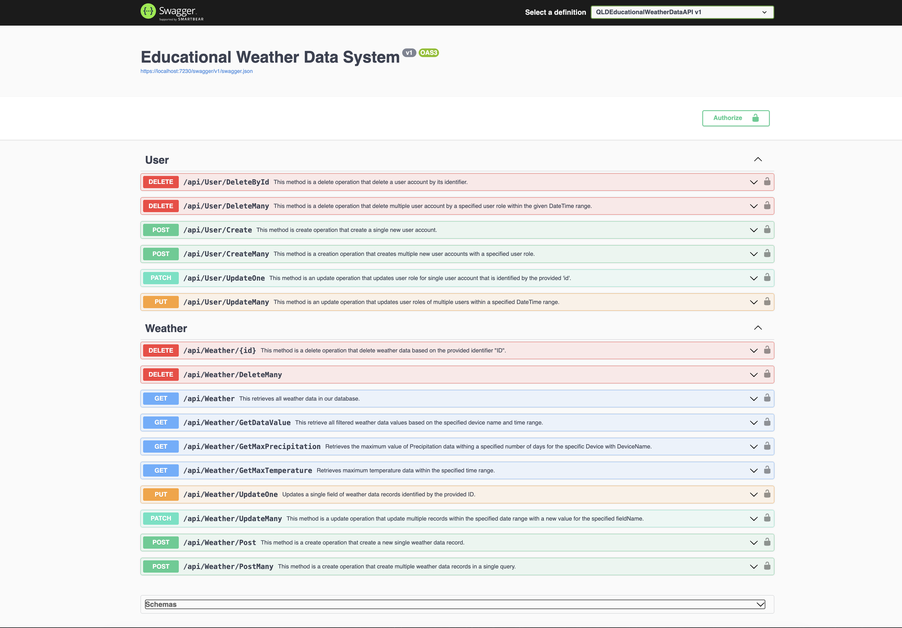
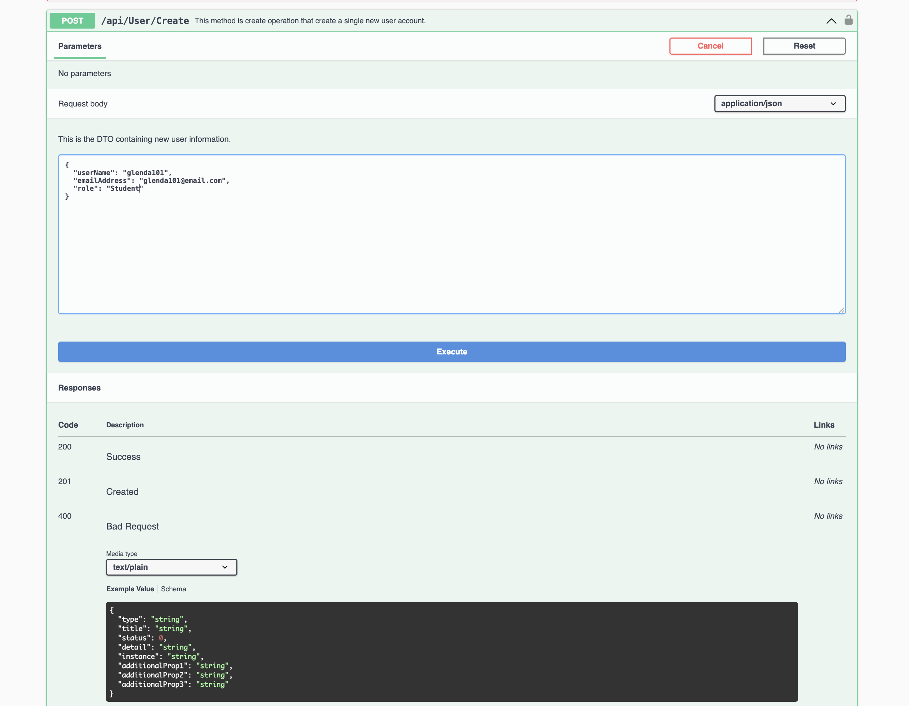
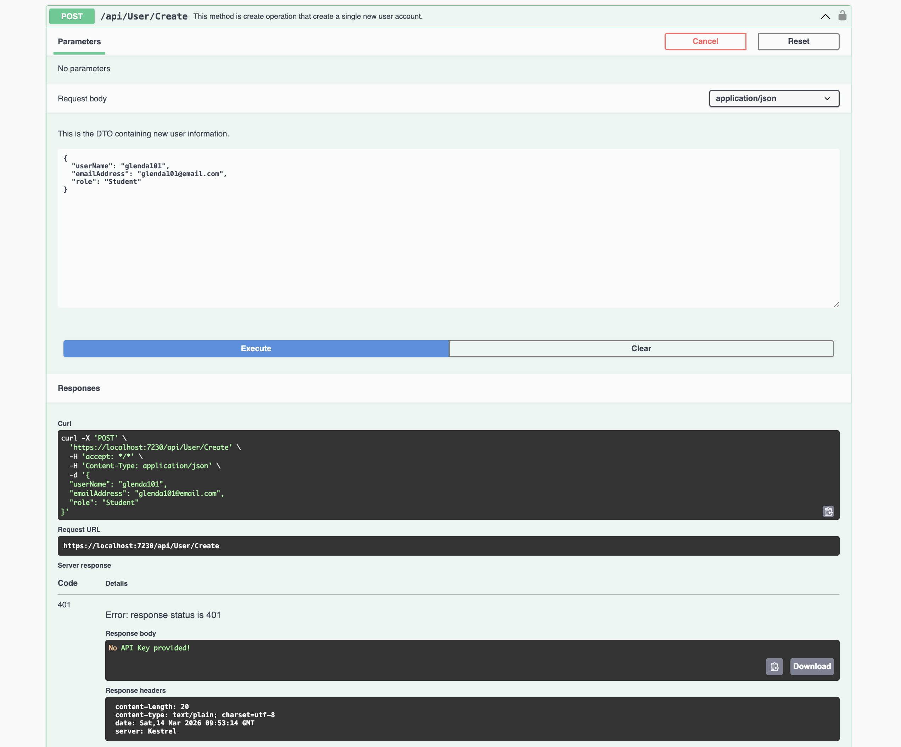

# Educational Weather Data API

## Project Description:

The Educational Weather Data API is a RESTful API built with .NET 10 SDK and a NoSQL database (MongoDB). It is designed for educational purposes to help students learn how APIs handle different HTTP requests, including:
  * POST – Create new data
  * GET – Retrieve data
  * PUT / PATCH – Update existing data
  * DELETE – Remove data
    
Users must have a valid API key to access or modify weather data. API key is a secret token that act as a unique identifier to identify and authenticate the users and developer, functioning like a password for 
applications that grant access to specific data and services and primarily used for authentication and access control ensuring secure access to data and prevents unauthorized use.

### Requirements:
  * .NET 10.0 SDK
  * NoSQL database (MongoDB - for storing weather data). 

### How to Run the Project:
1. Clone the repository
    * `git clone https://github.com/yourusername/RESTful-API_QLDWeatherDataAPI_Project.git`
2. Navigate to the project folder
    * `cd RESTful-API_QLDWeatherDataAPI_Project`
3. Restore dependencies
    * `dotnet restore`
4. Build the project
    * `dotnet build`
5. Run the application
    * `dotnet run`
6. Open the API in a browser
    * `https://localhost:7230/swagger`
    * This will launch Swagger UI, allowing you to test the API endpoints interactively.

### Project Structures:
  * Controllers/   - API endpoints  
  * Models/        - Data models  
  * Services/      - Business logic  
  * Settings/      - Configuration files  
  * Program.cs     - Application entry point

### Technologies Used
  * C#
  * .NET 10 SDK
  * NoSQL (MongoDB) for Weather Data Sensor Files
  * RESTful APIs design

### Security Features:
  * API key authentication for all requests.
  * Access control to prevent unauthorized users from modifying or retrieving data.
  * Educational focus on secure CRUD operations in APIs.

### Weather Data API UI Overview

### Sample Endpoint Request

### Sample Endpoint Response

## Author

### Glenda Patino Fulgidezza
